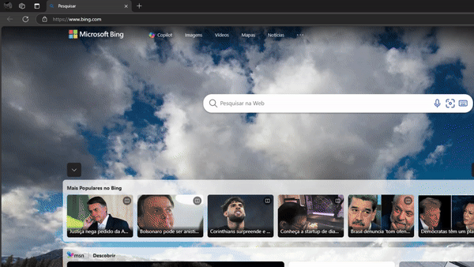
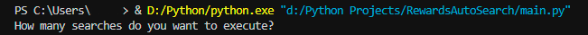

# ✨ Microsoft Rewards Search Bot ✨

A simple Python script that automates searches on Bing to earn points on Microsoft Rewards.

**DESKTOP ONLY!**



## 🛠️ Installation

### Requirements:
- Microsoft Edge (only works with Edge)
- An IDE that runs Python code

### How to Install:
1. Download `main.py` and open it in your preferred IDE.
2. Install the `pyautogui` package through the IDE's terminal by running:

    ```bash
    py -m pip install pyautogui
    ```

4. Update the path to point to where Edge is installed on your computer:
   - On Windows, the default path should work as long as it correctly points to "msedge.exe".
   - On Linux or macOS, adjust the path according to where Edge's binary is located.

    ```python
    get(r'C:\Program Files (x86)\Microsoft\Edge\Application\msedge.exe').open_new('https://www.bing.com/')
    ```

## 🚀 How to Use
1. Run the script and enter the number of searches you want to execute.
   - For example, 30 searches will earn you around 90 points.



2. Press **ENTER** and ❗️DO NOT move your mouse while the script is running❗️
